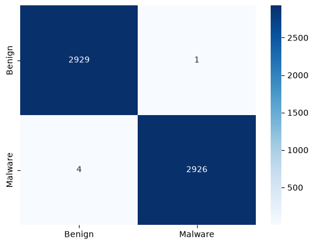
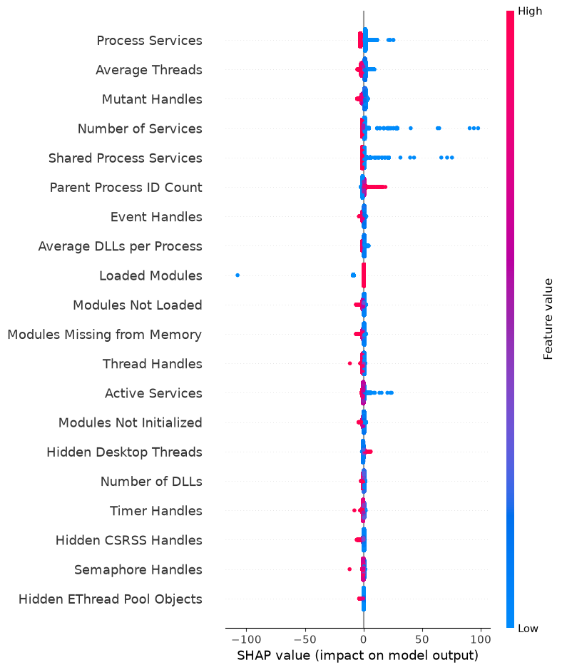

# MemShield 
Detects malware from computer memory snapshots using machine learning.

## Objective
Malware behaves differently from normal programs in memory. MemShield analyzes 55 memory activity features extracted from system memory dumps and classifies them as **benign or malicious** using Logistic Regression.

## Dataset
**CIC-MalMem-2022** — Canadian Institute for Cybersecurity
- 58,596 memory dump records
- 55 numerical features extracted from real-world malware samples
- Classes: Benign, Ransomware, Spyware, Trojan Horse
- Balanced dataset: 50% benign, 50% malicious

## Tech Stack
- Python
- Pandas, NumPy
- Scikit-learn
- Seaborn, Matplotlib
- SHAP

## How It Works
1. Load and explore the CIC-MalMem-2022 dataset
2. Drop label columns (`Category`, `Class`), keep 55 numerical features
3. Scale features using StandardScaler
4. Train Logistic Regression model on 90% of data
5. Evaluate on remaining 10%
6. Predict on new memory snapshots

## Results
| Metric | Score |
|---|---|
| Training Accuracy | 97.1% |
| Testing Accuracy | 97.1% |
| False Negatives (missed malware) | 22 |
| False Positives (false alarms) | 148 |

## Confusion Matrix


With only 22 false negatives out of 29,298 malware samples, the model is highly sensitive to real threats.

## Model Explainability (SHAP)
The model doesn't just predict — it explains *why* a program is flagged as malware.



### How to read this chart
- Features are ranked by importance (top = most influential)
- **Red dots** = high feature value, **Blue dots** = low feature value
- Dots on the **right** = pushed model towards malware
- Dots on the **left** = pushed model towards benign

### Key Findings
- **Process Services & Number of Services** — malware registers many services to persist on the system
- **Parent Process ID Count** — malware spawns many child processes to disguise itself
- **Shared Process Services** — malware hijacks shared services to avoid detection

## How to Run
```bash
pip install pandas numpy scikit-learn seaborn matplotlib shap
python model.py
python explain.py
```

## Dataset Source
Carrier, T. et al. (2022). CIC-MalMem-2022. Canadian Institute for Cybersecurity.  
https://www.unb.ca/cic/datasets/malmem-2022.htmlsets/malmem-2022.html
